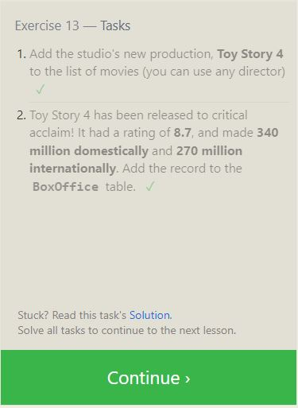

## SQL Practice

- Creating Databases: CREATE DATABASE command initializes a new database. Specify a name, creating a new space to manage data.
- Creating Tables: CREATE TABLE defines a new table structure. Specify columns with names and data types, structuring how data is stored.
- Inserting Data: INSERT INTO adds new records. Specify table name and values, populating the table with data.
- Querying Data: SELECT retrieves data. Specify columns and conditions, accessing specific information.
- Updating Data: UPDATE modifies existing records. Specify conditions and new values, altering data without removing it.
- Deleting Data: DELETE removes records. Specify conditions to target specific data, maintaining table structure.
- Data Types: VARCHAR for text, INTEGER for numbers, DATE for dates. Define the nature of data in each column.
- SQL Operators: AND, OR, BETWEEN for conditionals. Refine queries by combining conditions.
- Joining Tables: INNER JOIN and LEFT JOIN combine data from multiple tables. Specify common columns, creating relational data views.

- 
- 
- 
- 
- 
- 
- 
- 
- 
- 
- 
- 
